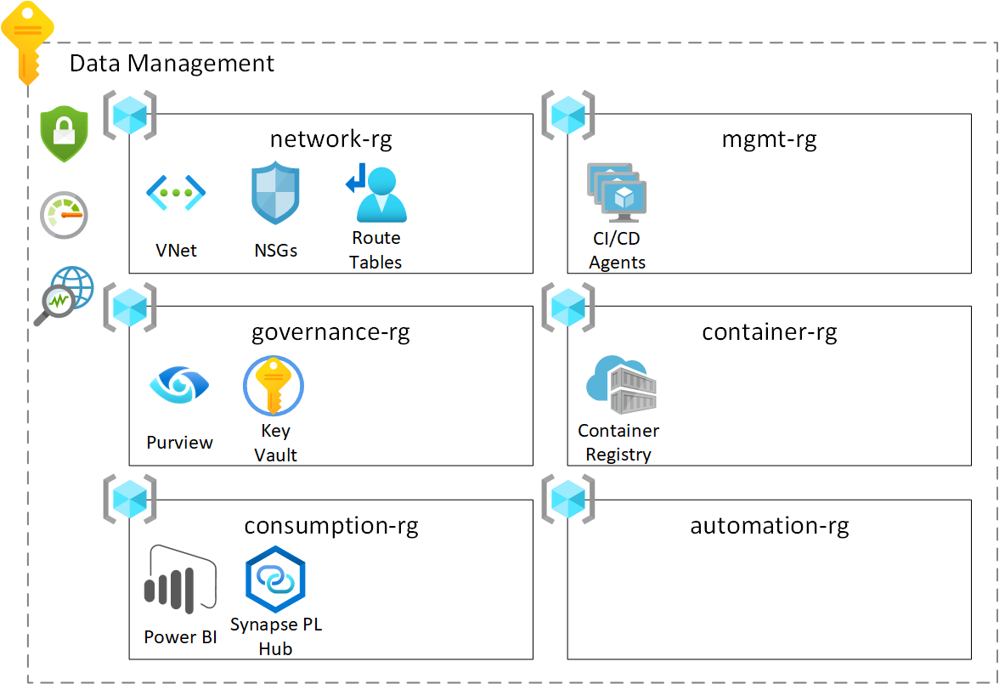
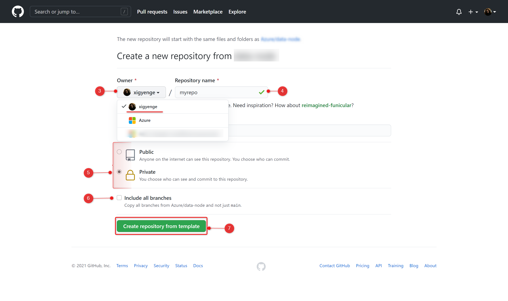
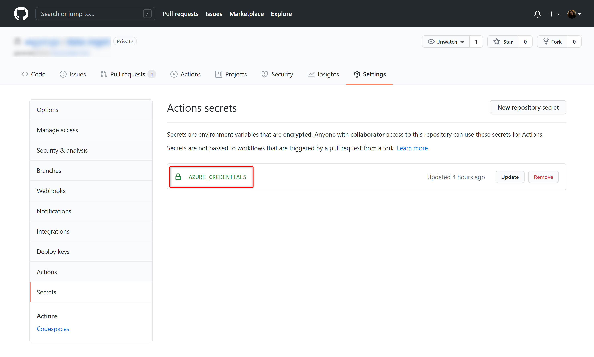
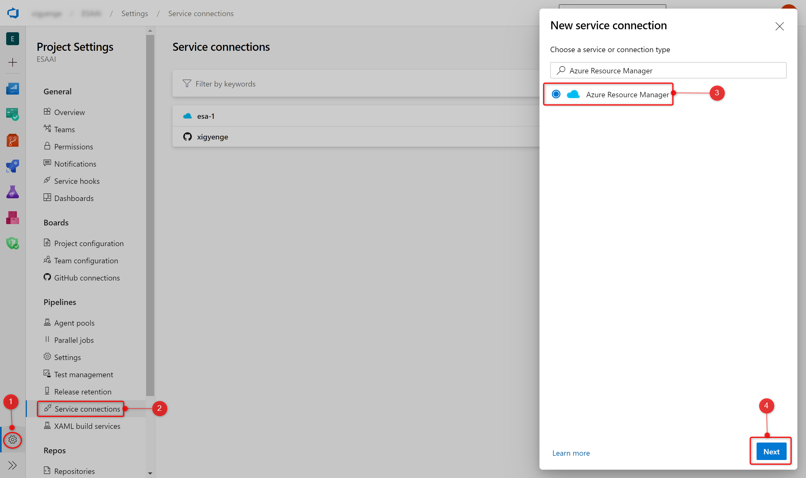
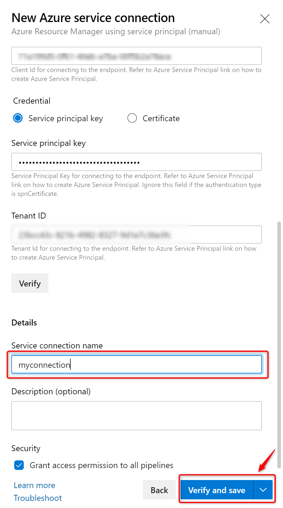
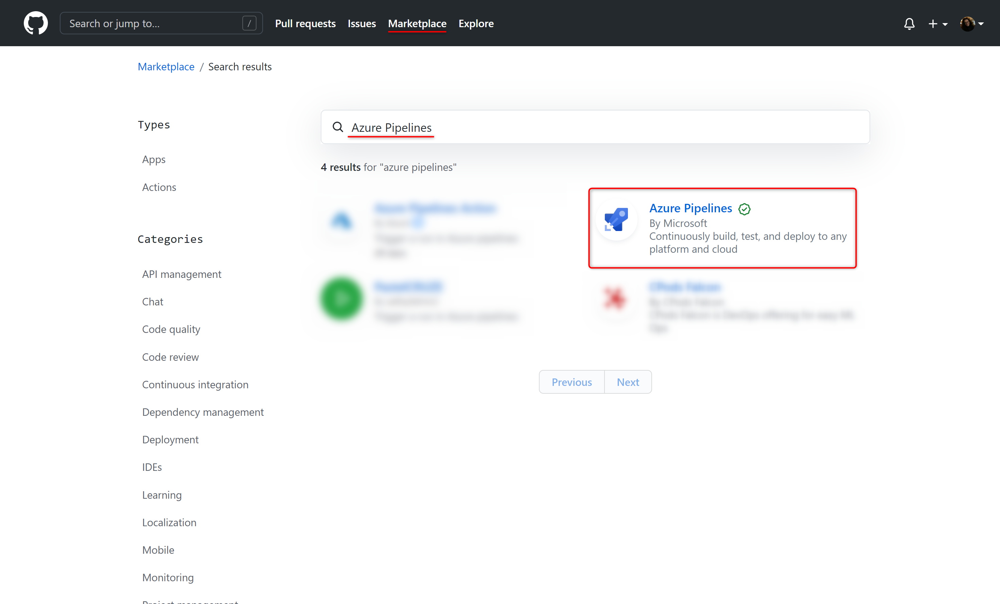
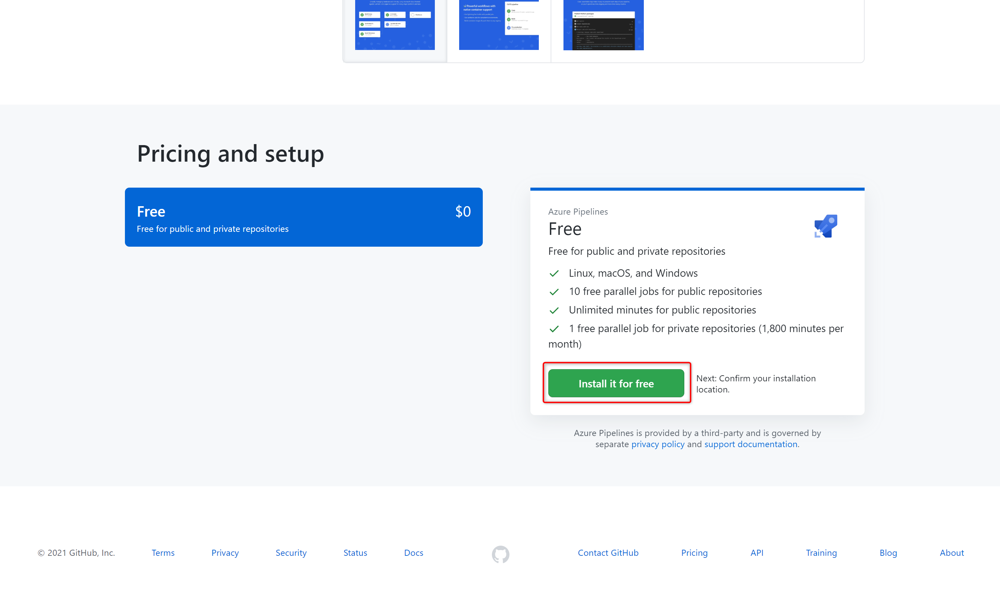
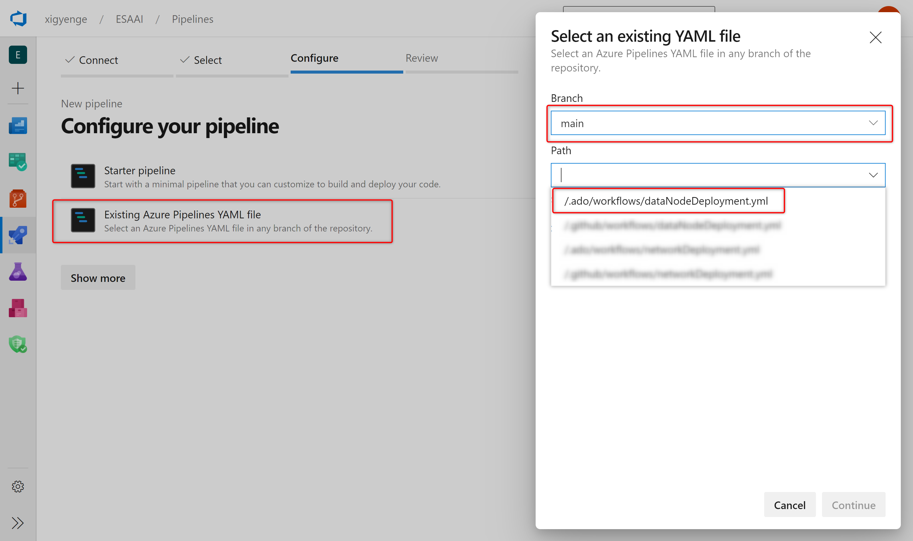

# Enterprise Scale Analytics - Data Management

> **General disclaimer** Please be aware that this template is in public preview. Therefore, expect smaller bugs and issues when working with the solution. Please submit an Issue, if you come across any issues that you would like us to fix.

# Description 
The Data Management template is, as the name suggessts, classified as a management function and is at the heart of the Enterprise Scale Analytics platform. It is responsible for the governance of the platform and enables communication to ingest data sources from Azure, 3rd Party Clouds and On-Premises data sources.

## What will be deployed?

By default, all the services which comes under Data Management Zone are enabled and you must explicitly disable them if you don't want it to be deployed. 

<p align="center">
   
</p>

 - [Virtual Network](https://docs.microsoft.com/en-us/azure/virtual-network/virtual-networks-overview)
 - [Network Security Groups](https://docs.microsoft.com/en-us/azure/virtual-network/network-security-groups-overview)
 - [Route Tables](https://docs.microsoft.com/en-us/azure/virtual-network/virtual-networks-udr-overview)
 - [Azure Firewall](https://docs.microsoft.com/en-us/azure/firewall/overview)
 - [Firewall Policy](https://docs.microsoft.com/en-us/azure/firewall-manager/policy-overview#:~:text=Firewall%20Policy%20is%20an%20Azure,work%20across%20regions%20and%20subscriptions.)
 - [Private DNS Zones](https://docs.microsoft.com/en-us/azure/dns/private-dns-privatednszone#:~:text=By%20using%20private%20DNS%20zones,that%20are%20linked%20to%20it.)
 - [Azure Container Registry](https://docs.microsoft.com/en-us/azure/container-registry/)
 - [Azure Purview](https://docs.microsoft.com/en-us/azure/purview/)
 - [Key Vault](https://docs.microsoft.com/en-us/azure/key-vault/general)
 - [Storage Account](https://docs.microsoft.com/en-us/azure/storage/common/storage-account-overview)
 - [Synapse PL Hub](https://docs.microsoft.com/en-us/azure/synapse-analytics/security/synapse-private-link-hubs)
 - [PowerBI](https://docs.microsoft.com/en-us/power-bi/fundamentals/power-bi-overview)
 - [Policies](https://docs.microsoft.com/en-us/azure/governance/policy/overview) 


For more details regarding the services which will be deployed, please check [Data Management](https://github.com/Azure/Enterprise-Scale-Analytics/blob/main/docs/02-datamanagement/01-overview.md).


You have two options for deploying this reference architecture:
1. Use the `Deploy to Azure` Button or
2. Use GitHub Actions or Azure DevOps Pipelines


# Prerequisites

The following prerequisites are required to make this repository work:
* An Azure subscription
* [User Access Administrator](https://docs.microsoft.com/en-us/azure/role-based-access-control/built-in-roles#user-access-administrator) or [Owner](https://docs.microsoft.com/en-us/azure/role-based-access-control/built-in-roles#owner) access to the subscription to be able to create a service principal and role assignments for it.

If you don’t have an Azure subscription, [create your Azure free account today](https://azure.microsoft.com/en-us/free/).

# Option 1: Deploy to Azure - Quickstart

| Data Management Zone |
|:---------------------|
[&nbsp;&nbsp;](https%3A%2F%2Fraw.githubusercontent.com%2FAzure%2Fdata-hub%2Fmain%2Fdocs%2Freference%2Fdeploy.dataHub.json)

# Option 2: GitHub Actions or Azure DevOps Pipelines

## 1. Create repository from a template

1. On GitHub, navigate to the main page of the repository.
2. Above the file list, click **Use this template**

<p align="center">
  
</p>

3. Use the **Owner** drop-down menu, and select the account you want to own the repository.
<p align="center">
  
</p>

4. Type a name for your repository, and an optional description.
5. Choose a repository visibility. For more information, see "[About repository visibility](https://docs.github.com/en/github/creating-cloning-and-archiving-repositories/about-repository-visibility)."
6. Optionally, to include the directory structure and files from all branches in the template, and not just the default branch, select **Include all branches**.
7. Click **Create repository from template**.

## 2. Setting up the required Service Principal and access

A service principal needs to be generated for authentication and authorization from GitHub or Azure DevOps to your Azure subscription. This is required to deploy resources to your environment. Just go to the `Azure Portal` to find the id of your subscription. Then start CLI or PowerShell, login to Azure, set the Azure context and execute the following commands to generate the required credentials:

**Azure CLI**
```sh
# Replace {service-principal-name} and {subscription-id}  with your 
# Azure subscription id and any name for your service principal.
az ad sp create-for-rbac \
  --name "{service-principal-name}" \
  --role "Contributor" \
  --scopes "/subscriptions/{subscription-id}" \
  --sdk-auth
```

**Azure Powershell**
```PowerShell
# Replace {service-principal-name} and {subscription-id}  with your 
# Azure subscription id and any name for your service principal.
New-AzADServicePrincipal `
  -DisplayName "{service-principal-name}" `
  -Role "Contributor" `
  -Scope "/subscriptions/{subscription-id}"
```
This will generate the following JSON output:

```JSON
{
  "clientId": "<GUID>",
  "clientSecret": "<GUID>",
  "subscriptionId": "<GUID>",
  "tenantId": "<GUID>",
  (...)
}
```

**Take note of the output. It will be required for the next steps.**

<!-- For automation purposes of this repo, few more role assignments are required for this service principal. 

> NOTE: The number of role assignments can be further reduced in a production scenario. The **Network Contributor** role assignment is just required in this repository to automatically setup the vnet peering between the data management environment and the data landing zone. Without this, DNS resolution will not work and in- and outbound traffic will be dropped, because there is no line of sight to the Azure Firewall. The **Private DNS Zone Contributor** is also not required, if the deployment of DNS A-records of the Private Endpoints is automated through Azure Policies with `deployIfNotExists` effect. Same is true for the **User Access Administrator**, because the deployment can be automated using `deployIfNotExists` Policies.

Required role assignments include:

| Role Name | Description | Scope |
|:----------|:------------|:------|
| [Private DNS Zone Contributor](https://docs.microsoft.com/en-us/azure/role-based-access-control/built-in-roles#private-dns-zone-contributor) | We expect you to deploy all Private DNS zones for all data services into a single subscription and resource group. The service principal needs to be Private DNS Zone Contributor on that resource group. This is required to deploy A-records for the respective private endpoints.&nbsp;&nbsp;&nbsp;&nbsp;&nbsp;&nbsp;&nbsp;&nbsp;&nbsp;&nbsp;&nbsp;&nbsp;&nbsp;&nbsp;&nbsp;&nbsp;&nbsp;&nbsp;&nbsp;&nbsp;&nbsp;&nbsp;&nbsp;&nbsp;&nbsp;&nbsp;&nbsp;&nbsp;&nbsp;&nbsp;&nbsp;&nbsp;&nbsp;&nbsp;&nbsp;&nbsp;&nbsp;&nbsp;&nbsp;&nbsp;&nbsp;&nbsp;&nbsp;&nbsp;&nbsp;&nbsp;&nbsp;&nbsp;&nbsp;&nbsp;&nbsp;&nbsp;&nbsp;&nbsp;&nbsp;&nbsp;&nbsp;&nbsp;&nbsp;&nbsp;&nbsp;&nbsp;&nbsp;&nbsp;&nbsp;&nbsp;&nbsp;&nbsp;&nbsp;&nbsp;&nbsp;&nbsp;&nbsp;&nbsp;&nbsp;&nbsp;&nbsp;&nbsp;&nbsp;&nbsp;&nbsp;&nbsp;&nbsp;&nbsp;&nbsp;&nbsp;&nbsp;&nbsp;&nbsp;&nbsp;&nbsp;&nbsp;&nbsp;&nbsp;&nbsp;&nbsp;&nbsp; | (Resource Group Scope) `/subscriptions/{subscriptionId}/resourceGroups/{resourceGroupName}` |
| [User Access Administrator](https://docs.microsoft.com/en-us/azure/role-based-access-control/built-in-roles#user-access-administrator) | In order to share the self-hosted integration runtime that gets deployed into the `integration-rg` resource group with other Data Factories, like the one in the `processing-domain-rg` resource group, the service principle needs User Access Administrator rights on the Data Factory that gets deployed into the `integration-rg` resource group. | (Resource Scope) `/subscriptions/{subscriptionId}/resourceGroups/{resourceGroupName} /providers/Microsoft.DataFactory/factories/{dataFactoryName}` |
| [Network Contributor](https://docs.microsoft.com/en-us/azure/role-based-access-control/built-in-roles#network-contributor) | In order to setup vnet peering between the Data Landing Zone vnet and the Data Management Landing Zone vnet, the service principal needs Network Contributor access rights on the resource group of the remote vnet. | (Resource Group Scope) `/subscriptions/{subscriptionId}/resourceGroups/{resourceGroupName}` |

To add these role assignments, you can use the [Azure Portal](https://portal.azure.com/) or run the following commands:

**Azure CLI**
```Sh
# Get Service Principle Object ID
az ad sp list --display-name "{servicePrincipalName}" --query "[].{objectId:objectId}" --output tsv

# Add role assignment
# 1. Resource Scope
az role assignment create \
  --assignee "{servicePrincipalObjectId}" \
  --role "{roleName}" \
  --scopes "{scope}"

# 2. Resource group scope
az role assignment create \
  --assignee "{servicePrincipalObjectId}" \
  --role "{roleName}" \
  --resource-group "{resourceGroupName}"
```

**Azure Powershell**
```PowerShell
# Get Service Principle Object ID
$spObjectId = (Get-AzADServicePrincipal -DisplayName "{servicePrincipalName}").id

# Add role assignment
# 1. Resource Scope
New-AzRoleAssignment `
  -ObjectId $spObjectId `
  -RoleDefinitionName "{roleName}" `
  -Scope "{scope}"

# 2. Resource group scope
New-AzRoleAssignment `
  -ObjectId $spObjectId `
  -RoleDefinitionName "{roleName}" `
  -ResourceGroupName "{resourceGroupName}"
``` -->

Now you can choose, whether you would like to use GitHub Actions or Azure DevOps for your deployment.

## 3. a) GitHub Actions

If you want to use GitHub Actions for deploying the resources, add the previous JSON output as a [repository secret](https://docs.github.com/en/actions/reference/encrypted-secrets#creating-encrypted-secrets-for-a-repository) with the name `AZURE_CREDENTIALS` in your GitHub repository:

<p align="center">
  
</p>

To do so, execute the following steps:

1. On GitHub, navigate to the main page of the repository.
2. Under your repository name, click on the **Settings** tab.
3. In the left sidebar, click **Secrets**.
4. Click **New repository secret**.
5. Type the name `AZURE_CREDENTIALS` for your secret in the Name input box.
6. Enter the JSON output from above as value for your secret.
7. Click **Add secret**.

## 3. b) Azure DevOps

If you want to use Azure DevOps Pipelines for deploying the resources, you need to create an Azure Resource Manager service connection. To do so, execute the following steps:

1. First, you need to create an Azure DevOps Project. Instructions can be found [here](https://docs.microsoft.com/en-us/azure/devops/organizations/projects/create-project?view=azure-devops&tabs=preview-page).
2. In Azure DevOps, open the **Project settings**.
3. Now, select the **Service connections** page from the project settings page.
4. Choose **New service connection** and select **Azure Resource Manager**.

<p align="center">
  
</p>

5. On the next page select **Service principal (manual)**.
6. Select the appropriate environment to which you would like to deploy the templates. Default and tested option is **Azure Cloud**.
7. For the **Scope Level**, select **Subscription** and enter your `subscription Id` and `name`.
8. Enter the details of the service principal that we have generated in step 3. (**Service Principal Id** = **clientId**, **Service Principal Key** = **clientSecret**, **Tenant ID** = **tenantId**) and click on **Verify** to make sure that the connection works.
9. Enter a user-friendly **Connection name** to use when referring to this service connection. Take note of the name, because this will be required in the parameter update process. 
10. Optionally, enter a **Description**.
11. Click on **Verify and save**.

<p align="center">
  
</p>

More information can be found [here](https://docs.microsoft.com/en-us/azure/devops/pipelines/library/connect-to-azure?view=azure-devops#create-an-azure-resource-manager-service-connection-with-an-existing-service-principal).

## 4. Parameter Update Process

In order to deploy the ARM templates in this repository to the desired Azure subscription, you'll need to modify some parameters in the forked repository. As updating each parameter file manually is a time consuming process, which could lead as well to undesired user errors, we have simplified the process with a  GitHub Action workflow. After successfully executing the previous steps, please open the <a href="/.github/workflows/updateParameters.yml">`/.github/workflows/updateParameters.yml"` YAML file</a>. In this file you need to update the environment variables. Once you commit the file with the updated values, a GitHub Action workflow will be triggered that replaces all parameters accordingly. Just click on <a href="/.github/workflows/updateParameters.yml">`/.github/workflows/updateParameters.yml"`</a> and edit the following section: 


```YAML
env:
  DATA_HUB_SUBSCRIPTION_ID: '{dataHubSubscriptionId}'
  DATA_HUB_NAME: '{dataHubName}' # Choose max. 11 characters. They will be used as a prefix for all services. If not unique, deployment can fail for some services.
  LOCATION: '{regionName}'       # Specifies the region for all services (e.g. 'northeurope', 'eastus', etc.)
  AZURE_RESOURCE_MANAGER_CONNECTION_NAME: '{resourceManagerConnectionName}'
```

The parameters have the following meaning:

| Parameter                                | Description  | Sample value |
|:-----------------------------------------|:-------------|:-------------|
| **DATA_HUB_SUBSCRIPTION_ID**             | Specifies the subscription ID of the Data Management Zone where all the resources will be deployed &nbsp;&nbsp;&nbsp;&nbsp;&nbsp;&nbsp;&nbsp;&nbsp;&nbsp;&nbsp;&nbsp;&nbsp;&nbsp;&nbsp;&nbsp;&nbsp;&nbsp;&nbsp;&nbsp;&nbsp;&nbsp;&nbsp;&nbsp;&nbsp;&nbsp;&nbsp;&nbsp;&nbsp;&nbsp;&nbsp;&nbsp;&nbsp;&nbsp;&nbsp;&nbsp;&nbsp;&nbsp;&nbsp;&nbsp;&nbsp;&nbsp;&nbsp;&nbsp;&nbsp;&nbsp;&nbsp;&nbsp;&nbsp;&nbsp;&nbsp;&nbsp;&nbsp;&nbsp;&nbsp;&nbsp;&nbsp;&nbsp;&nbsp;&nbsp;&nbsp;&nbsp;&nbsp;&nbsp;&nbsp;&nbsp;&nbsp;&nbsp;&nbsp;&nbsp;&nbsp;&nbsp;&nbsp;&nbsp;&nbsp;&nbsp;&nbsp;&nbsp;&nbsp;&nbsp;&nbsp;&nbsp;&nbsp;&nbsp;&nbsp;&nbsp;&nbsp;&nbsp;&nbsp;&nbsp;&nbsp;&nbsp;&nbsp;&nbsp;&nbsp;&nbsp;&nbsp;&nbsp;&nbsp;&nbsp;&nbsp;&nbsp;&nbsp;&nbsp;&nbsp;&nbsp;&nbsp;&nbsp;&nbsp;&nbsp;&nbsp;&nbsp;&nbsp;&nbsp;&nbsp;&nbsp;&nbsp;&nbsp;&nbsp;&nbsp; | `xxxxxxxx-xxxx-xxxx-xxxx-xxxxxxxxxxxx`&nbsp;&nbsp;&nbsp;&nbsp;&nbsp;&nbsp;&nbsp;&nbsp;&nbsp;&nbsp;&nbsp;&nbsp;&nbsp;&nbsp;&nbsp;&nbsp;&nbsp;&nbsp;&nbsp;&nbsp;&nbsp;&nbsp;&nbsp;&nbsp;&nbsp;&nbsp;&nbsp;&nbsp;&nbsp;&nbsp; |
| **DATA_HUB_NAME**        | Specifies the name of your Data Management Zone. The value should consist of alphanumeric characters (A-Z, a-z, 0-9) and should not contain any special characters like -, _, ., etc. Special characters will be removed in the renaming process. | `myhub01` |
| **LOCATION**                                 | Specifies the region where you want the resources to be deployed. | `northeurope` |
| **AZURE_RESOURCE_MANAGER _CONNECTION_NAME**   | Specifies the resource manager connection name in Azure DevOps. You can leave the default value, if you want to use GitHub Actions for your deployment. More details on how to create the resource manager connection in Azure DevOps can be found in step 4. b) or [here](https://docs.microsoft.com/en-us/azure/devops/pipelines/library/connect-to-azure?view=azure-devops#create-an-azure-resource-manager-service-connection-with-an-existing-service-principal). | `my-connection-name` |

&nbsp;&nbsp;&nbsp;&nbsp;&nbsp;&nbsp;&nbsp;&nbsp;&nbsp;&nbsp;&nbsp;&nbsp;

After updating the values, please commit the updated version to the `main` branch. This will kick off a GitHub Action workflow, which will appear under the **Actions** tab of the main page of the repository. The `Update Parameter Files` workflow will update all parameters in your repository according to a certain naming convention. Once the process has finished, it will open a Pull Request in your repository, where you can review the changes made by the workflow. Please follow the instructions in the Pull Request to complete the parameter update process. We are not renaming the environment variables in the workflow files, because this can have undesired outcomes of kicking of an infinite number of workflows. 

After following the instructions in the Pull request, you can merge the pull request back into the `main` branch of your repository by clicking on **Merge pull request**. Finally, you can click on **Delete branch** to clean up your repository.

## 5. (not applicable for GH Actions) Reference pipeline from GitHub repository in Azure DevOps pipelines

### 1. Install Azure DevOps Pipelines GitHub Application

First you need to add and install the Azure Pipelines GitHub App to your GitHub account. To do so, execute the following steps:

1. Click on **Marketplace** in the top navigation bar on GitHub.
2. In the Marketplace, search for **Azure Pipelines**. The Azure Pipelines offering is free for anyone to use for public repositories, and free for a single build queue if you’re using a private repository.

<p align="center">
  
</p>

4. Select it and click on **Install it for free**.

<p align="center">
  
</p>

5. If you are part of multiple **GitHub** organisations, select the one you forked this repository to from the **Switch billing account** dropdown menu.
6. You may be prompted to confirm your GitHub password to continue. 
7. You may be prompted to log in to your Microsoft account. Make sure you are logged into the one taht is associated with your Azure DevOps account.

### 2. Configuring Azure Pipelines project

As a last step, you need to reference the Azure DevOps Yaml pipeline, that is stored in your GitHub repository, as a Pipeline in your Azure DevOps Project. To do so, execute the following steps: 

1. Select the project, where you have setup your `Resource Manager Connection`.
2. Select **Pipelines** and then **New Pipeline** in order to create a new pipeline.

<p align="center">
  
</p>
 
3. Choose **GitHub `YAML`** and search for your repository (e.g. "`GitHubUserName/RepositoryName`").

<p align="center">
  
</p>

4. Select your respository.
4. Click on **Existing Azure Pipelines in YAML file**
6. Select `main` as branch and `/.ado/workflows/dataNodeDeployment.yml` as path.

<p align="center">
  
</p>

7. Click on **Continue** and then on **Run**.

## 6. Follow the workflow deployment

**Congratulations!** You have successfully executed all steps to deploy the template into your environment through GitHub Actions or Azure DevOps.

If you are using GitHub Actions, you can navigate to the **Actions** tab of the main page of the repository, where you will see a workflow with the name `Data Management Deployment` running. Click on it to see how it deploys one service after another. If you run into any issues, please open an issue [here](https://github.com/Azure/data-landing-zone/issues).

If you are using Azure DevOps Pipelines, you can navigate to the pipeline that you have created as part of step 6 and follow  how it deploys one service after another. If you run into any issues, please open an issue [here](https://github.com/Azure/data-management-zone/issues).

# Enterprise Scale Analytics Documentation and Implementation

- [Documentation](https://github.com/Azure/Enterprise-Scale-Analytics)
- [Implementation - Data Management](https://github.com/Azure/data-management-zone)
- [Implementation - Data Landing Zone](https://github.com/Azure/data-landing-zone)
- [Implementation - Data Domain - Batch](https://github.com/Azure/data-domain-batch)
- [Implementation - Data Domain - Streaming](https://github.com/Azure/data-domain-streaming)
- [Implementation - Data Product - Reporting](https://github.com/Azure/data-product-reporting)
- [Implementation - Data Product - Analytics & Data Science](https://github.com/Azure/data-product-analytics)

# Contributing

This project welcomes contributions and suggestions.  Most contributions require you to agree to a
Contributor License Agreement (CLA) declaring that you have the right to, and actually do, grant us
the rights to use your contribution. For details, visit https://cla.opensource.microsoft.com.

When you submit a pull request, a CLA bot will automatically determine whether you need to provide
a CLA and decorate the PR appropriately (e.g., status check, comment). Simply follow the instructions
provided by the bot. You will only need to do this once across all repos using our CLA.

This project has adopted the [Microsoft Open Source Code of Conduct](https://opensource.microsoft.com/codeofconduct/).
For more information see the [Code of Conduct FAQ](https://opensource.microsoft.com/codeofconduct/faq/) or
contact [opencode@microsoft.com](mailto:opencode@microsoft.com) with any additional questions or comments.
