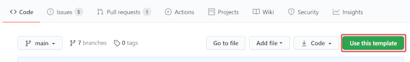
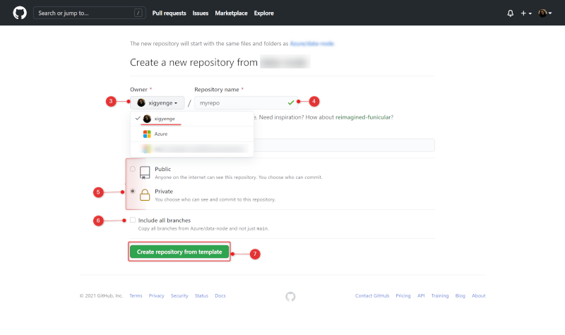

# Enterprise Scale Analytics - Data Management

> **General disclaimer:** Please be aware that this template is in private preview. Therefore, expect smaller bugs and issues when working with the solution. Please submit an Issue in GitHub if you come across any issues that you would like us to fix.

**DO NOT COPY - UNDER DEVELOPMENT - MS INTERNAL ONLY - Please be aware that this template is in private preview without any SLA.**

## Description

The Data Management template is, as the name suggests, classified as a management function and is at the heart of the [**Enterprise Scale Analytics and AI**](https://github.com/Azure/Enterprise-Scale-Analytics) solution pattern. It is responsible for the governance of the platform and enables communication to ingest data sources from Azure, third-party clouds and on-premises data sources.

## What will be deployed?

By default, all the services which come under Data Management Zone are enabled, and you must explicitly disable services that you don't want to be deployed.

> **Note:** Before deploying the resources, we recommend to check registration status of the required resource providers in your subscription. For more information, see [Resource providers for Azure services](https://docs.microsoft.com/azure/azure-resource-manager/management/resource-providers-and-types).


- [Virtual Network](https://docs.microsoft.com/azure/virtual-network/virtual-networks-overview)
- [Network Security Groups](https://docs.microsoft.com/azure/virtual-network/network-security-groups-overview)
- [Route Tables](https://docs.microsoft.com/azure/virtual-network/virtual-networks-udr-overview)
- [Azure Firewall](https://docs.microsoft.com/azure/firewall/overview)
- [Firewall Policy](https://docs.microsoft.com/azure/firewall-manager/policy-overview#:~:text=Firewall%20Policy%20is%20an%20Azure,work%20across%20regions%20and%20subscriptions.)
- [Private DNS Zones](https://docs.microsoft.com/azure/dns/private-dns-privatednszone#:~:text=By%20using%20private%20DNS%20zones,that%20are%20linked%20to%20it.)
- [Container Registry](https://docs.microsoft.com/azure/container-registry/)
- [Purview](https://docs.microsoft.com/azure/purview/)
- [Key Vault](https://docs.microsoft.com/azure/key-vault/general)
- [Storage Account](https://docs.microsoft.com/azure/storage/common/storage-account-overview)
- [Synapse Private Link Hub](https://docs.microsoft.com/azure/synapse-analytics/security/synapse-private-link-hubs)
- [PowerBI](https://docs.microsoft.com/power-bi/fundamentals/power-bi-overview)
- [Policies](https://docs.microsoft.com/azure/governance/policy/overview)

For more details regarding the services that will be deployed, please read the [Data Management](https://github.com/Azure/Enterprise-Scale-Analytics/blob/main/docs/02-datamanagement/01-overview.md) guide in the Enterprise Scale Analytics documentation.

You have two options for deploying this reference architecture:

1. Use the `Deploy to Azure` button for an immediate deployment
2. Use GitHub Actions or Azure DevOps Pipelines for an automated, repeatable deployment

## Prerequisites

The following prerequisites are required to make this repository work:

- an Azure subscription
- [User Access Administrator](https://docs.microsoft.com/azure/role-based-access-control/built-in-roles#user-access-administrator) or [Owner](https://docs.microsoft.com/azure/role-based-access-control/built-in-roles#owner) access to the subscription to be able to create a service principal and role assignments for it.
- For deployment, please choose one of the below **Supported Regions** list.

### **Supported Regions:**

- Asia Southeast
- Europe North
- Europe West
- France Central
- Japan East
- South Africa North
- UK South
- US Central
- US East
- US East 2
- US West 2

If you don't have an Azure subscription, [create your Azure free account today](https://azure.microsoft.com/free/).

## Option 1: Deploy to Azure - Quickstart (Coming soon ...)

| Data Management Zone |
|:---------------------|
<!-- [](https://portal.azure.com/#create/Microsoft.Template/uri/https%3A%2F%2Fraw.githubusercontent.com%2FAzure%2Fdata-management-zone%2Fmain%2Fdocs%2Freference%2Fdeploy.dataHub.json) -->


## Option 2: GitHub Actions or Azure DevOps Pipelines

### 1. Create repository from a template

1. On GitHub, navigate to the main page of this repository.
1. Above the file list, click **Use this template**

    

1. Use the **Owner** drop-down menu and select the account you want to own the repository.

    

1. Type a name for your repository and an optional description.
1. Choose a repository visibility. For more information, see "[About repository visibility](https://docs.github.com/en/github/creating-cloning-and-archiving-repositories/about-repository-visibility)."
1. Optionally, to include the directory structure and files from all branches in the template and not just the default branch, select **Include all branches**.
1. Click **Create repository from template**.

### 2. Setting up the required Service Principal and access

A service principal with *Contributor* role needs to be generated for authentication and authorization from GitHub or Azure DevOps to your Azure subscription. This is required to deploy resources to your environment. Just go to the Azure Portal to find the ID of your subscription. Then start the Cloud Shell or Azure CLI, login to Azure, set the Azure context and execute the following commands to generate the required credentials:

#### Azure CLI

```sh
# Replace {service-principal-name} and {subscription-id} with your
# Azure subscription id and any name for your service principal.
az ad sp create-for-rbac \
  --name "{service-principal-name}" \
  --role "Contributor" \
  --scopes "/subscriptions/{subscription-id}" \
  --sdk-auth
```

This will generate the following JSON output:

```json
{
  "clientId": "<GUID>",
  "clientSecret": "<GUID>",
  "subscriptionId": "<GUID>",
  "tenantId": "<GUID>",
  (...)
}
```

> **Note:** Take note of the output. It will be required for the next steps.

### 3. Resource Deployment

Now that you have set up the Service Principal, you need to choose how would you like to deploy the resources. Deployment options:

1. [GitHub Actions](#github-actions)
1. [Azure DevOps](#azure-devops)

#### GitHub Actions

If you want to use GitHub Actions for deploying the resources, add the previous JSON output as a [repository secret](https://docs.github.com/en/actions/reference/encrypted-secrets#creating-encrypted-secrets-for-a-repository) with the name `AZURE_CREDENTIALS` in your GitHub repository:


To do so, execute the following steps:

1. On GitHub, navigate to the main page of the repository.
2. Under your repository name, click on the **Settings** tab.
3. In the left sidebar, click **Secrets**.
4. Click **New repository secret**.
5. Type the name `AZURE_CREDENTIALS` for your secret in the Name input box.
6. Enter the JSON output from above as value for your secret.
7. Click **Add secret**.

#### Azure DevOps

If you want to use Azure DevOps Pipelines for deploying the resources, you need to create an Azure Resource Manager service connection. To do so, execute the following steps:

1. First, you need to create an Azure DevOps Project. Instructions can be found [here](https://docs.microsoft.com/azure/devops/organizations/projects/create-project?view=azure-devops&tabs=preview-page).
1. In Azure DevOps, open the **Project settings**.
1. Now, select the **Service connections** page from the project settings page.
1. Choose **New service connection** and select **Azure Resource Manager**.

   

1. On the next page select **Service principal (manual)**.
1. Select the appropriate environment to which you would like to deploy the templates. Only the default option **Azure Cloud** is currently supported.
1. For the **Scope Level**, select **Subscription** and enter your `subscription Id` and `name`.
1. Enter the details of the service principal that we have generated in step 3. (**Service Principal Id** = **clientId**, **Service Principal Key** = **clientSecret**, **Tenant ID** = **tenantId**) and click on **Verify** to make sure that the connection works.
1. Enter a user-friendly **Connection name** to use when referring to this service connection. Take note of the name because this will be required in the parameter update process.
1. Optionally, enter a **Description**.
1. Click on **Verify and save**.

    

More information can be found [here](https://docs.microsoft.com/azure/devops/pipelines/library/connect-to-azure?view=azure-devops#create-an-azure-resource-manager-service-connection-with-an-existing-service-principal).

### 4. Parameter Update Process

> **Note:** This section applies for both **Azure DevOps** and **GitHub** Deployment

In order to deploy the ARM templates in this repository to the desired Azure subscription, you will need to modify some parameters in the forked repository, which will be used for updating the files which will be used during the deployment. Therefor, **this step should not be skipped for neither Azure DevOps/GitHub options**. As updating each parameter file manually is a time-consuming and potentially error-prone process, we have simplified the task with a GitHub Action workflow. You can update your deployment parameters by completing three steps:

  1. Configure the `updateParameters` workflow
  1. Execute the `updateParameters` workflow
  1. Configure the deployment pipeline
  1. Merge these changes back to the `main` branch of your repo

#### Configure the `updateParameters` workflow

> **Note:** There is only one 'updateParameters.yml', which can be found under the '.github' folder and this one will be used also for setting up the Azure DevOps Deployment

To begin, please open the [.github/workflows/updateParameters.yml](/.github/workflows/updateParameters.yml). In this file you need to update the environment variables. Just click on [.github/workflows/updateParameters.yml](/.github/workflows/updateParameters.yml) and edit the following section:

```yaml
env:
  DATA_HUB_SUBSCRIPTION_ID: '{dataHubSubscriptionId}'
  DATA_HUB_NAME: '{dataHubName}' # Choose max. 11 characters. They will be used as a prefix for all services. If not unique, deployment can fail for some services.
  LOCATION: '{regionName}'       # Specifies the region for all services (e.g. 'northeurope', 'eastus', etc.)
  AZURE_RESOURCE_MANAGER_CONNECTION_NAME: '{resourceManagerConnectionName}'
```

The following table explains each of the parameters:

| Parameter                                | Description  | Sample value |
|:-----------------------------------------|:-------------|:-------------|
| **DATA_HUB_SUBSCRIPTION_ID**             | Specifies the subscription ID of the Data Management Zone where all the resources will be deployed | <div style="width: 36ch">`xxxxxxxx-xxxx-xxxx-xxxx-xxxxxxxxxxxx`</div> |
| **DATA_HUB_NAME**        | Specifies the name of your Data Management Zone. The value should consist of alphanumeric characters (A-Z, a-z, 0-9) and should not contain any special characters like `-`, `_`, `.`, etc. Special characters will be removed in the renaming process. | `myhub01` |
| **LOCATION**                                 | Specifies the region where you want the resources to be deployed. Please check [Supported Regions](#supported-regions)  | `northeurope` |
| **AZURE_RESOURCE_MANAGER _CONNECTION_NAME**   | Specifies the resource manager connection name in Azure DevOps. You can leave the default value if you want to use GitHub Actions for your deployment. More details on how to create the resource manager connection in Azure DevOps can be found in step 4. b) or [here](https://docs.microsoft.com/azure/devops/pipelines/library/connect-to-azure?view=azure-devops#create-an-azure-resource-manager-service-connection-with-an-existing-service-principal). | `my-connection-name` |

&nbsp;&nbsp;&nbsp;&nbsp;&nbsp;&nbsp;&nbsp;&nbsp;&nbsp;&nbsp;&nbsp;&nbsp;

#### Execute the `updateParameters` workflow

After updating the values, please commit the updated version to the `main` branch of your repository. This will kick off a GitHub Action workflow, which will appear under the **Actions** tab of the main page of the repository. The `Update Parameter Files` workflow will update all parameters in your repository according to a pre-defined naming convention.

#### Configure the deployment pipeline

The workflow above will make changes to all of the ARM config files. These changes will be stored in a new branch. Once the process has finished, it will open a new pull request in your repository where you can review the changes made by the workflow. The pull request will also provide the values you need to use to configure the deployment pipeline. Please follow the instructions in the pull request to complete the parameter update process.

If you are using GitHub Actions for your deployment, you will need to modify the `.github/workflows/dataHubDeployment.yml` file. If you are using Azure Pipelines, you only need to modify the `.ado/workflows/dataHubDeployment.yml` file.  **You only need to modify one of these files. You do not need to modify both of them.**

> **Note:** We are not renaming the environment variables in the workflow files because this could lead to an infinite loop of workflow runs being started.

#### Merge these changes back to the `main` branch of your repo

After following the instructions in the pull request, you can merge the pull request back into the `main` branch of your repository by clicking on **Merge pull request**. Finally, you can click on **Delete branch** to clean up your repository.

### 5. (not applicable for GH Actions) Reference pipeline from GitHub repository in Azure DevOps Pipelines

#### Install Azure DevOps Pipelines GitHub Application

First you need to add and install the Azure Pipelines GitHub App to your GitHub account. To do so, execute the following steps:

1. Click on **Marketplace** in the top navigation bar on GitHub.
1. In the Marketplace, search for **Azure Pipelines**. The Azure Pipelines offering is free for anyone to use for public repositories and free for a single build queue if you're using a private repository.

    

1. Select it and click on **Install it for free**.

    

1. If you are part of multiple **GitHub** organizations, you may need to use the **Switch billing account** dropdown to select the one into which you forked this repository.
1. You may be prompted to confirm your GitHub password to continue.
1. You may be prompted to log in to your Microsoft account. Make sure you log in with the one that is associated with your Azure DevOps account.

#### Configuring the Azure Pipelines project

As a last step, you need to create an Azure DevOps pipeline in your project based on the pipeline definition YAML file that is stored in your GitHub repository. To do so, execute the following steps:

1. Select the Azure DevOps project where you have setup your `Resource Manager Connection`.
1. Select **Pipelines** and then **New Pipeline** in order to create a new pipeline.

    

1. Choose **GitHub YAML** and search for your repository (e.g. "`GitHubUserName/RepositoryName`").

    

1. Select your repository.
1. Click on **Existing Azure Pipelines in YAML file**
1. Select `main` as branch and `/.ado/workflows/dataHubDeployment.yml` as path.

    

1. Click on **Continue** and then on **Run**.

### 6. Follow the workflow deployment

**Congratulations!** You have successfully executed all steps to deploy the template into your environment through GitHub Actions or Azure DevOps.

If you are using GitHub Actions, you can navigate to the **Actions** tab of the main page of the repository, where you will see a workflow with the name `Data Management Deployment` running. Click on it to see how it deploys one service after another. If you run into any issues, please open an issue [here](https://github.com/Azure/data-management-zone/issues).

If you are using Azure DevOps Pipelines, you can navigate to the pipeline that you have created as part of step 6 and monitor it as each service is deployed. If you run into any issues, please open an issue [here](https://github.com/Azure/data-management-zone/issues).

### Documentation

### Code Structure

| File/folder                   | Description                                |
| ----------------------------- | ------------------------------------------ |
| `.ado/workflows`              | Folder for ADO workflows. The `dataDomainDeployment.yml` workflow shows the steps for an end-to-end deployment of the architecture. |
| `.github/workflows`           | Folder for GitHub workflows. The `updateParameters.yml` workflow is used for the parameter update process, while the `dataDomainDeployment.yml` workflow shows the steps for an end-to-end deployment of the architecture. |
| `code`                        | Sample password generation script that will be run in the deployment workflow for resources that require a password during the deployment. |
| `configs`                     | Folder containing a script and configuration file that is used for the parameter update process. |
| `docs`                        | Resources for this README.                 |
| `infra`                       | Folder containing all the ARM templates for each of the resources that will be deployed (`deploy.{resource}.json`) together with their parameter files (`params.{resource}.json`). |
| `CODE_OF_CONDUCT.md`          | Microsoft Open Source Code of Conduct.     |
| `LICENSE`                     | The license for the sample.                |
| `README.md`                   | This README file.                          |
| `SECURITY.md`                 | Microsoft Security README.                 |

### Enterprise Scale Analytics and AI - Documentation and Implementation

- [Documentation](https://github.com/Azure/Enterprise-Scale-Analytics)
- [Implementation - Data Management](https://github.com/Azure/data-management-zone)
- [Implementation - Data Landing Zone](https://github.com/Azure/data-landing-zone)
- [Implementation - Data Domain - Batch](https://github.com/Azure/data-domain-batch)
- [Implementation - Data Domain - Streaming](https://github.com/Azure/data-domain-streaming)
- [Implementation - Data Product - Reporting](https://github.com/Azure/data-product-reporting)
- [Implementation - Data Product - Analytics & Data Science](https://github.com/Azure/data-product-analytics)

## Known issues

### Error: MissingSubscriptionRegistration

**Error Message:**

```sh
ERROR: Deployment failed. Correlation ID: ***
  "error": ***
    "code": "MissingSubscriptionRegistration",
    "message": "The subscription is not registered to use namespace 'Microsoft.DocumentDB'. See https://aka.ms/rps-not-found for how to register subscriptions.",
    "details": [
      ***
        "code": "MissingSubscriptionRegistration",
        "target": "Microsoft.DocumentDB",
        "message": "The subscription is not registered to use namespace 'Microsoft.DocumentDB'. See https://aka.ms/rps-not-found for how to register subscriptions."

```

**Solution:**

This error message appears, in case during the deployment it tries to create a type of resource which has never been deployed before inside the subscription. We recommend to check prior the deployment whether the required resource providers are registered for your subscription and if needed, register them through the `Azure Portal`, `Azure Powershell` or `Azure CLI` as mentioned [here](https://docs.microsoft.com/azure/azure-resource-manager/management/resource-providers-and-types).

**Error Message:**

```sh
"statusMessage": "{\"error\":{\"code\":\"InvalidTemplateDeployment\",\"message\":\"The template deployment 'deploy.purview' is not valid according to the validation procedure. The tracking id is '9e22893b-1e0a-48ba-800c-77a27a86cade'. See inner errors for details.\",\"details\":[{\"code\":\"1000\",\"message\":\"Failed to list providers from ARM. Exception: The client '38a6ed90-8590-42fb-b09f-fbcf6f6849c3' with object id '38a6ed90-8590-42fb-b09f-fbcf6f6849c3' does not have authorization to perform action 'Microsoft.Resources/subscriptions/providers/read' over scope '/subscriptions/9ae0dd4c-d127-4901-bb76-46d39676a2cc' or the scope is invalid. If access was recently granted, please refresh your credentials.\"}]}}"
"eventCategory": "Administrative",

```

**Solution:**

**Error Purview Specific** This error message appears during the deployment of Purview in case it was not registered inside the subscription. We recommend to check prior the deployment whether the 'purview' resource providers is registered for your subscription and if needed, register it through the `Azure Portal`, `Azure Powershell` or `Azure CLI` as mentioned [here](https://docs.microsoft.com/azure/azure-resource-manager/management/resource-providers-and-types).

## Contributing

This project welcomes contributions and suggestions. Most contributions require you to agree to a Contributor License Agreement (CLA) declaring that you have the right to, and actually do, grant us the rights to use your contribution. For details, visit <https://cla.opensource.microsoft.com>.

When you submit a pull request, a CLA bot will automatically determine whether you need to provide a CLA and decorate the PR appropriately (e.g., status check, comment). Simply follow the instructions provided by the bot. You will only need to do this once across all repositories using our CLA.

This project has adopted the [Microsoft Open Source Code of Conduct](https://opensource.microsoft.com/codeofconduct/). For more information see the [Code of Conduct FAQ](https://opensource.microsoft.com/codeofconduct/faq/) or contact [opencode@microsoft.com](mailto:opencode@microsoft.com) with any additional questions or comments.

